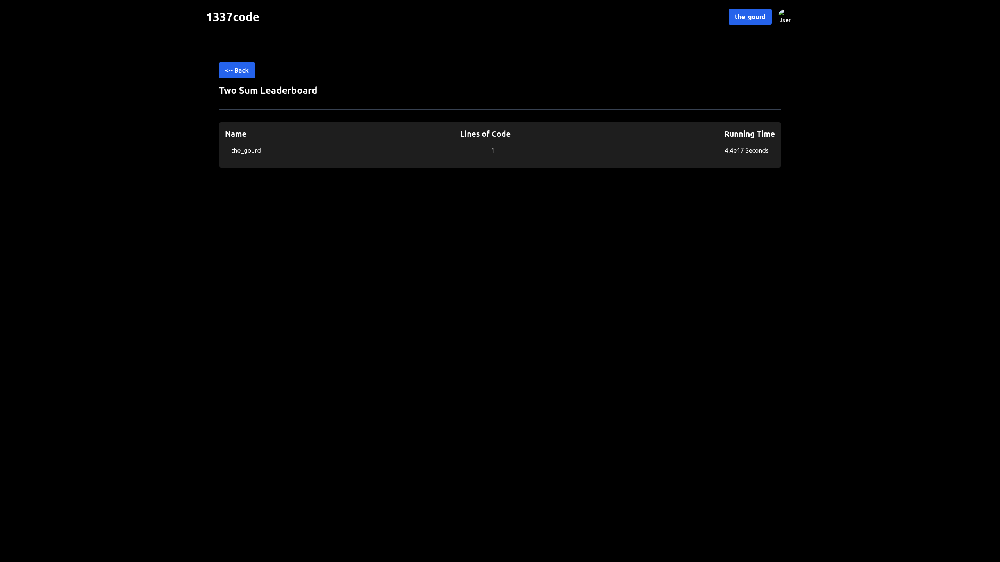

# CS260 Startup - Dots and Boxes Across the World
Have you ever had the problem where you've felt the urge to play dots and boxes with your friend, but they happen to not be in the same physical location as you?  
What? What do you mean you haven't? You don't know what dots and boxes is? Well don't I have the product for you!

## Dots and Boxes
(as traditionally played on paper, images not representative of my product; not my mock)  
Dots and boxes is a multiplayer game that takes place on a m x n grid of dots:  
  
Images courtesy of [wikihow](https://www.wikihow.com/Play-Dots-and-Boxes)  

Each player takes a turn drawing a horizontal or vertical line between two adjacent dots:  
  

Players attempt to draw the last line to complete a box, and when they do, they claim that box and gain a point:  
  

When this happens, the player goes again.  
This goes on till all boxes have been completed. The points are tallied up, and the player with the most points wins.  

## The Usual Problem  
As you can probably tell, the game is usually played with pen and paper. This becomes a problem when you're not in the same physical location as you desired opponent(s) as a given paper can only be in one place at once.

## The Solution--My Product of Course (give me your money)
My startup solves this urgent problem caused by the limitations of paper by using web technologies to host a multiplayer game of dots and boxes.  

It does so unconstrained, allowing for game parameters unseen in its physical predecessor, such as stupidly large grid dimensions and large amounts of players.  
  
A rough sketch of a normal size play grid of my final product  

A rather large play grid  

  
A grid that would be infeasable on any other medium than digital  

  
A game with too many players to fit in one room or usual physical space  

As you can see, the default dots and boxes medium should have been the web ages ago. It enables so much more freedom than the traditional medium.  

The centralized medium also allows for accurate scoreboard keeping, making a global leaderboard feasible.  
  

## CS260 Technology Requirements:  
My product will use websockets for facilitating making moves and receiving moves made by the other player.  
It will also use authentication and a database for keeping track of the global leaderboard.
